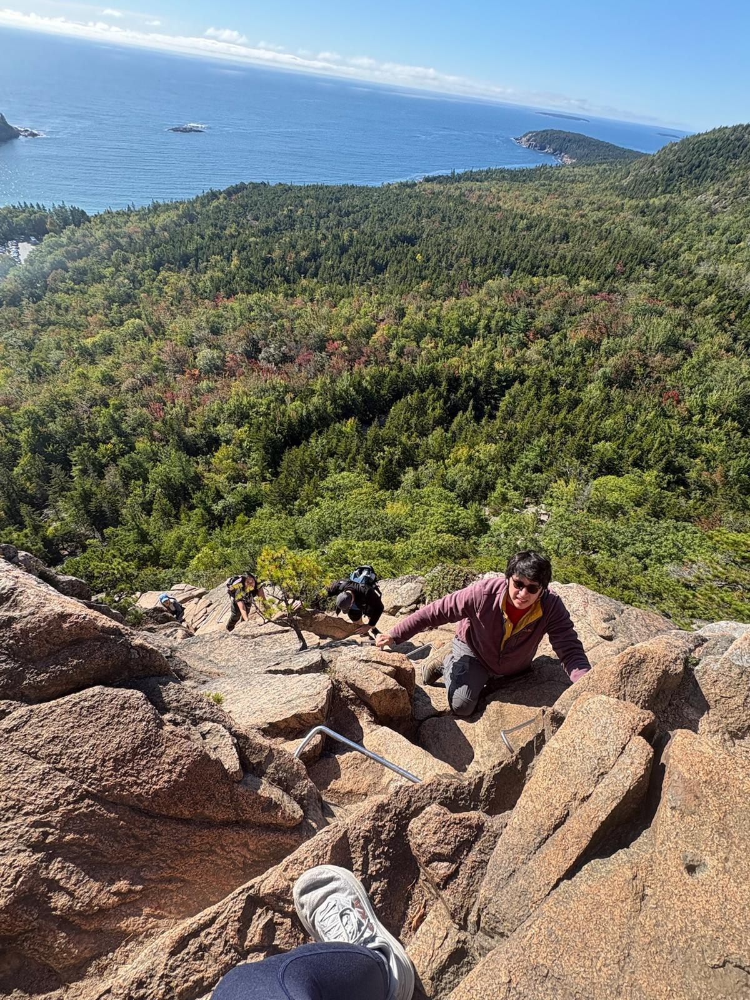
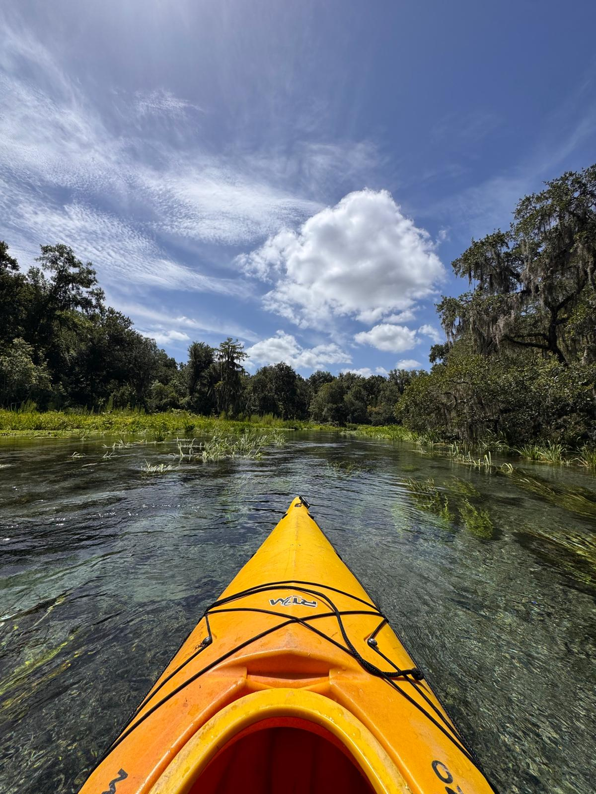
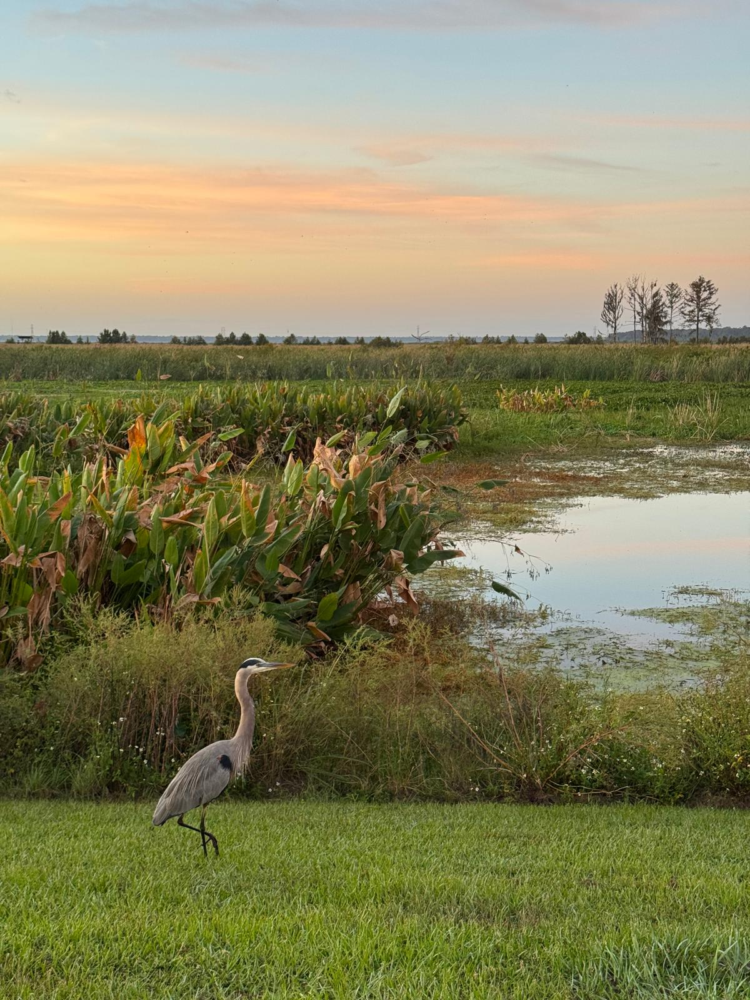
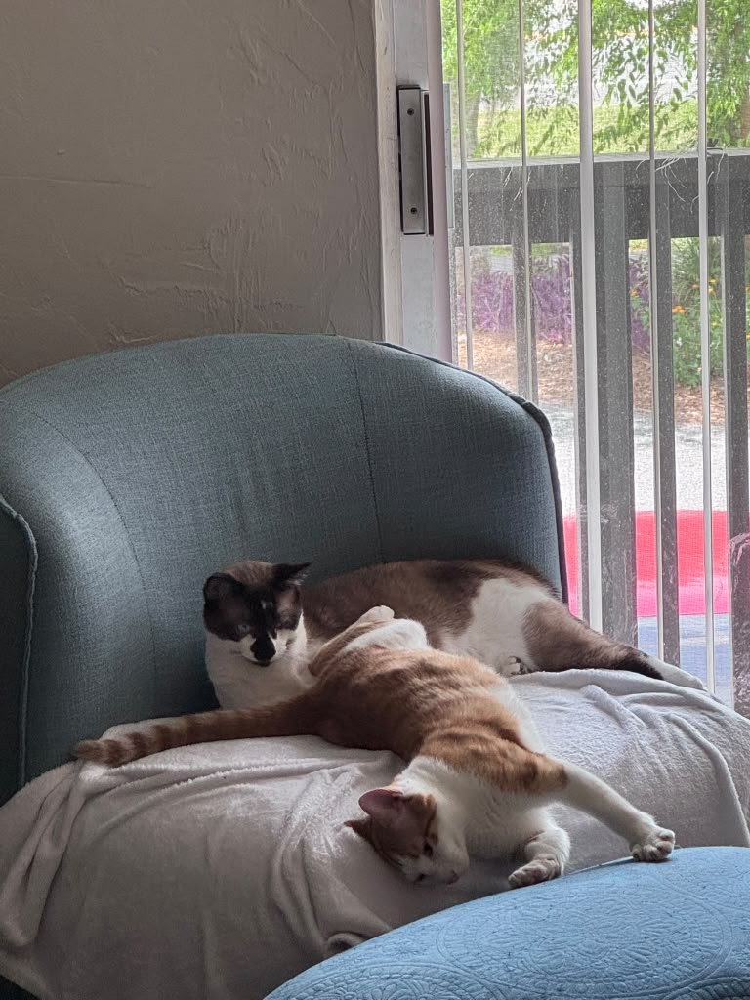

When I am not working, I like to spend time outdoors, hiking, climbing and paddling.

## Hiking and climbing

Even though I struggle with heights, I try to climb and hike whenever I can.

{fig-alt="Roberto climbing a steep granite section of the Beehive Loop Trail, with forest and the Atlantic coast below" width="65%" fig-align="center"}

## Florida springs and wetlands

::: {layout-ncol=2}
{fig-alt="Bow of a yellow kayak on a clear spring-fed river lined with trees" group="florida"}

{fig-alt="A great blue heron on the grass beside a marsh at sunset" group="florida"}
:::

## Murph and Mochi

I share my home with two cats, Murph and Mochi. Both are tripods, and I adopted them to give them a better life than the one they had before.

{fig-alt="Two cats lounging together on a blue armchair by a window, a brown and white cat behind an orange and white cat" width="65%" fig-align="center"}
