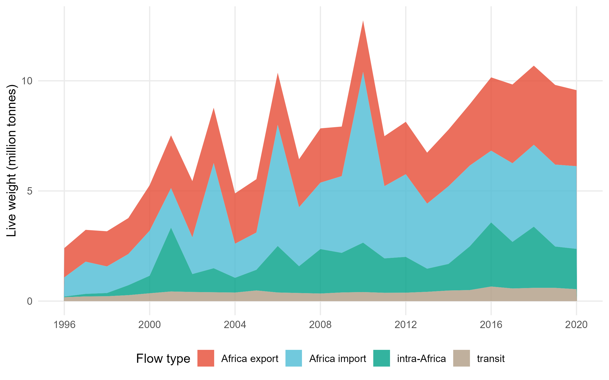
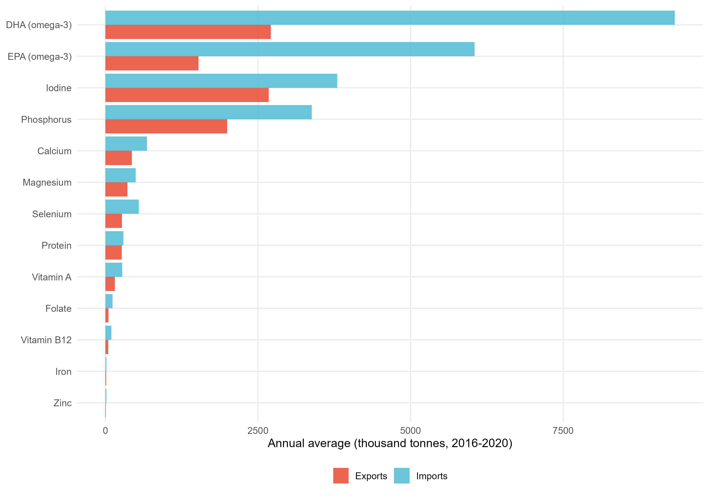
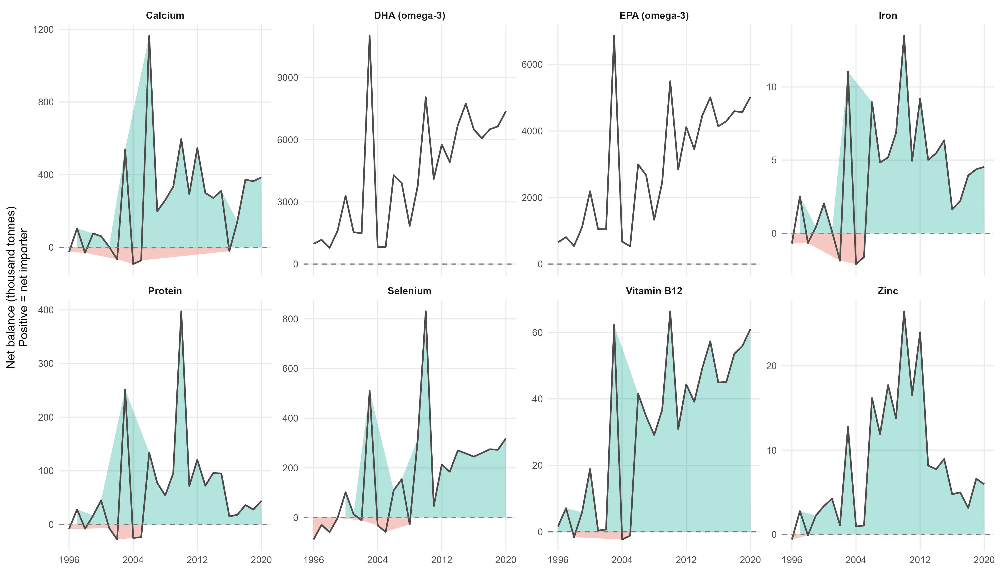
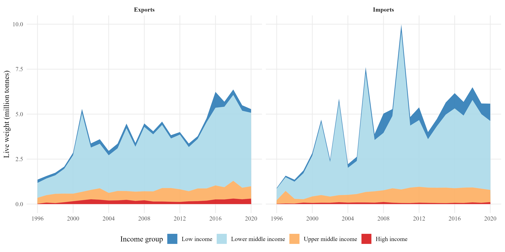
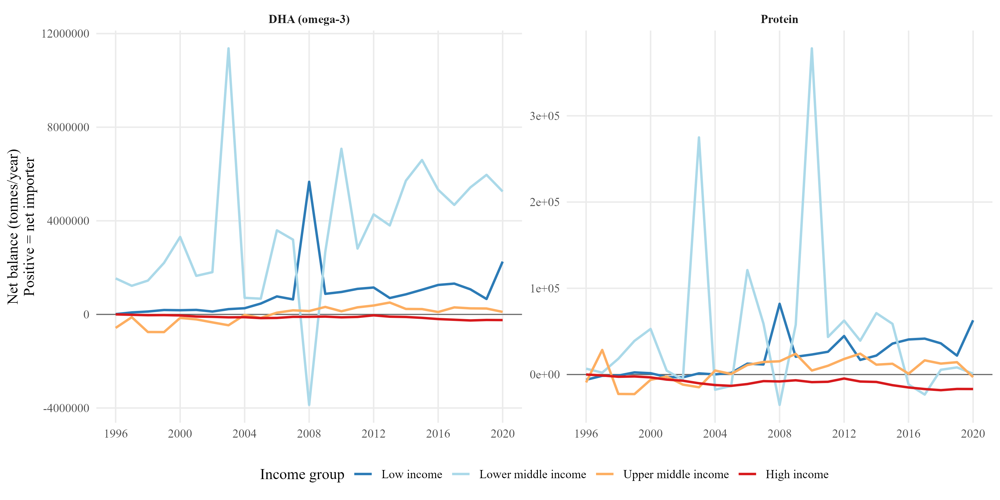
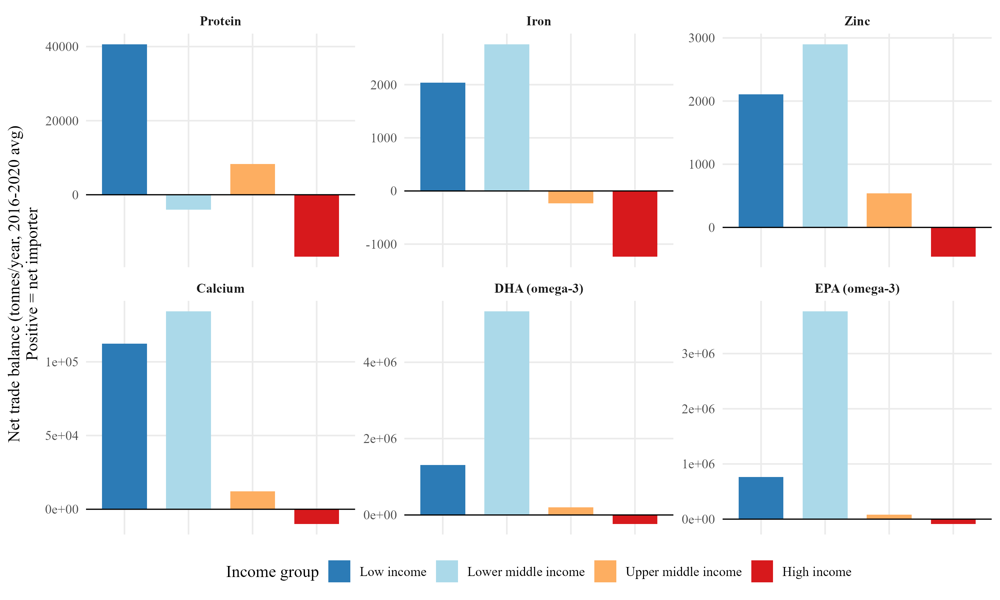

<a href="../index.qmd">← Back to Projects</a>

## Overview

This project studies Africa's seafood trade through the lens of **nutrition, not just tonnage**. Using species-level bilateral trade flows for 1996-2020, each traded shipment is converted into flows of protein, iron, zinc, calcium, and omega-3 fatty acids (DHA, EPA), so that trade can be read as flows of nutrients across borders, not just commodity volume. The guiding question: as Africa's seafood trade has grown, has it also strengthened the continent's access to nutrient-dense food, or is it exporting the nutrients its own population needs?

::: {.callout-warning}
This is an active working paper, not a finished publication. The figures below are descriptive results from an ongoing analysis; specifications, country coverage, and headline numbers may still change.
:::

## Data — what's actually behind these charts

Three data sources are combined, and each has real limitations worth being upfront about:

| Source | What it provides | Coverage |
|---|---|---|
| **ARTIS** (Aquatic Resource Trade in Species) | Species-level bilateral seafood trade flows, reconciled from customs/Comtrade data | 1996-2020, ~2,000 species, ~190 countries |
| **AFCD** (Aquatic Food Composition Database) | Nutrient content per 100g edible portion, by species | Matched to ARTIS via a species/genus crosswalk |
| **World Bank WDI** | GDP, population, and income-group classification | Merged by country-year |

**Turning trade volume into nutrient flows.** Each species' live-weight trade is multiplied by an edible-fraction assumption (0.5) and its AFCD nutrient content to get a flow of protein, iron, zinc, calcium, DHA, and EPA (and 7 other nutrients tracked but not shown here). Species without a direct AFCD match are matched at the genus level; together, exact and genus-level matches cover about **73% of traded live weight** — the remainder (mostly unclassified or artisanal-market species) contributes zero nutrient flow, which likely understates trade in lower-income countries that rely more on species outside the standard commercial catalog.

**What "trade" does and doesn't capture.** ARTIS reconciles official customs records. It does **not** capture informal or artisanal cross-border trade, which can be substantial in parts of West and Central Africa, nor does it capture fish caught and consumed domestically without ever entering recorded trade. Every number below is a trade-channel indicator, not a measure of total national fish consumption.

## Trade trends

Africa's recorded seafood trade nearly quadrupled between 1996 and 2020 — exports grew from 1.4 to 5.3 million tonnes (live weight), imports from 0.9 to 5.6 million tonnes. Intra-Africa trade (green) has grown fastest in relative terms, though it remains smaller than trade with the rest of the world.

{fig-alt="Africa's total seafood trade by flow type, 1996-2020" width="100%"}

## Nutrient trends

Converting trade volume into nutrient content changes the picture. Averaged over 2016-2020, **Africa is a net importer of every one of the 13 nutrients tracked** — it imports more protein, iron, zinc, calcium, and omega-3s embedded in seafood than it exports. The gap is smallest for protein (imports ~11% above exports) and largest for the omega-3 fatty acids DHA and EPA (imports 2.4-4.0x exports):

{fig-alt="Africa's seafood exports vs imports by nutrient, 2016-2020 average" width="100%"}

This net-import position has been fairly stable in relative terms but has grown enormously in absolute terms since the mid-2000s, as both exports and imports of nutrient-dense species have scaled up with overall trade volume:

{fig-alt="Net nutrient trade balance over time for 8 key nutrients" width="100%"}

## By income group

Splitting the continent's 53 countries by World Bank income classification (20 low income, 23 lower-middle income, 8 upper-middle income, 1 high income — Seychelles) shows the net-importer story is **not** shared equally.

Lower-middle income countries dominate both export and import volume — they are simply the biggest players in African seafood trade by tonnage:

{fig-alt="Seafood trade volume by income group, 1996-2020" width="100%"}

But looking at *net* nutrient balance tells a sharper story. Low-income and lower-middle-income countries are consistently net importers of protein and omega-3s — trade is, on net, bringing nutrients into these economies. The sole high-income country, Seychelles, is a striking outlier in the opposite direction:

{fig-alt="Net Protein and DHA trade balance by income group over time" width="100%"}

Across all 6 headline nutrients, the pattern holds: low- and lower-middle-income countries are net importers, while Seychelles is a large net *exporter* of every nutrient — a reflection of its role as a major Indian Ocean tuna transshipment and canning hub (a huge processing industry relative to its ~97,000 population), not a sign that its own population has more seafood-nutrient access:

{fig-alt="Net trade balance by income group across 6 headline nutrients, 2016-2020 average" width="100%"}

## Technical details

| | |
|---|---|
| **Language** | R |
| **Key packages** | `tidyverse`, `fixest`, `WDI`, `xgboost`, `penppml` |
| **Data** | ARTIS bulk trade data, AFCD nutrient database, World Bank WDI |
| **Methods used elsewhere in this project** | PPML gravity models, lasso-based variable selection (Breinlich et al. 2021 adaptation), K-means clustering of country nutrient-trade profiles, gradient-boosting forecast benchmarking |
| **Status** | Working paper in progress |
