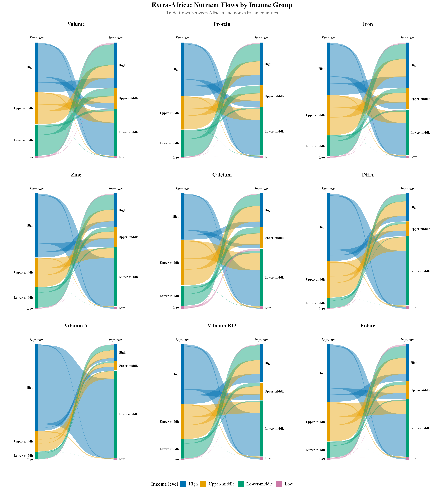
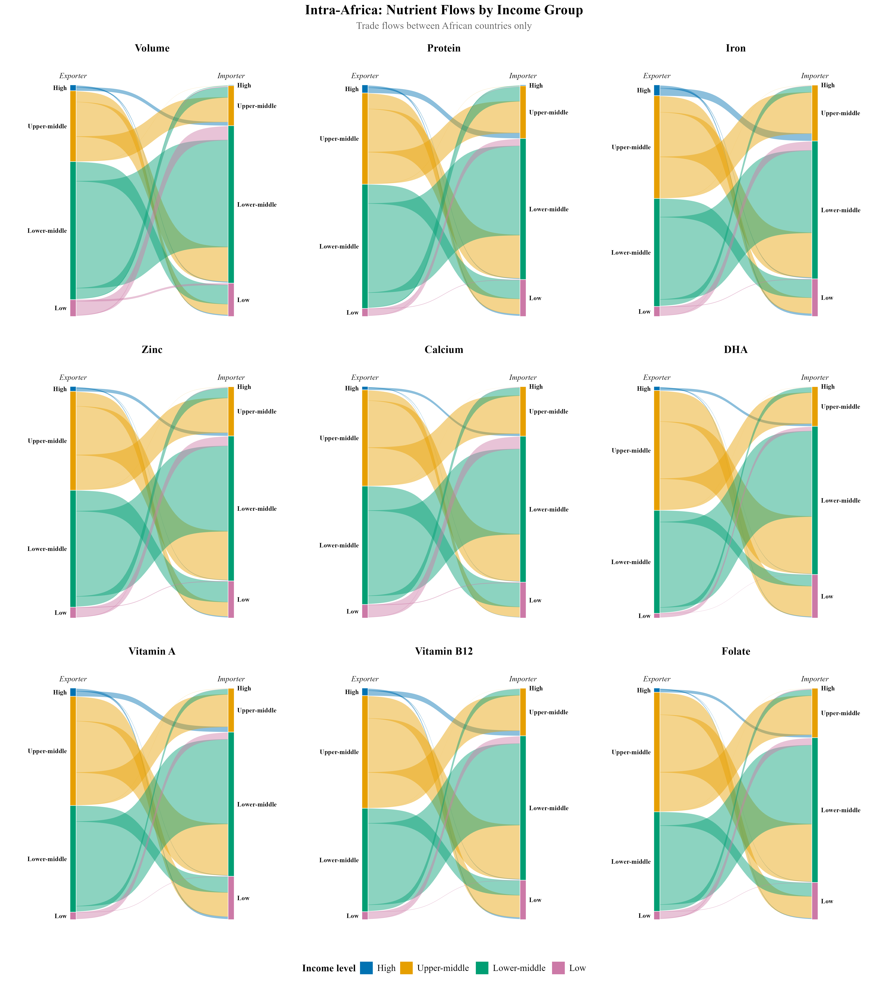
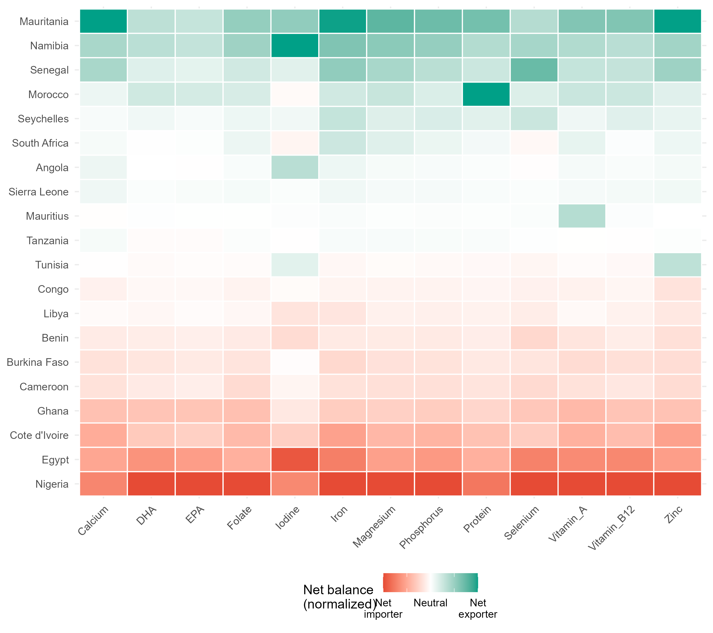

<a href="../index.qmd">← Back to Projects</a>

## Overview

Species-level bilateral seafood trade data lets each shipment be converted into flows of protein, iron, zinc, calcium, and omega-3 fatty acids (DHA, EPA), not just tonnage. This is a preliminary look at where those nutrients actually go, split by World Bank income group and by whether trade stays within Africa or crosses into the rest of the world.

::: {.callout-warning}
This is an active working paper. Figures below are preliminary and the full analysis is not yet public.
:::

## Nutrient flows by income group

Trade with the rest of the world (left) looks very different from trade within Africa (right). Ribbon width is proportional to nutrient volume; color denotes the exporting income group.

{fig-alt="Sankey diagram of nutrient flows between African and non-African countries by income group" width="100%"}

{fig-alt="Sankey diagram of nutrient flows between African countries only by income group" width="100%"}

## Which countries are net importers vs exporters

Normalized net trade balance by country and nutrient (green = net exporter, red = net importer):

{fig-alt="Heatmap of normalized net nutrient trade balance by African country" width="100%"}

## Data

Built from species-level bilateral trade data merged with a nutrient-content crosswalk and World Bank income classifications. Full data and methods documentation to follow with the working paper.
