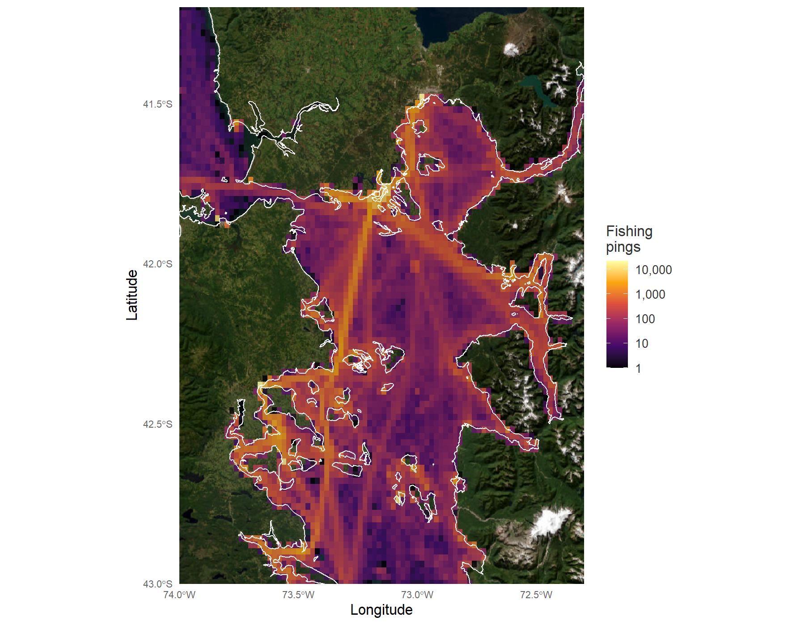
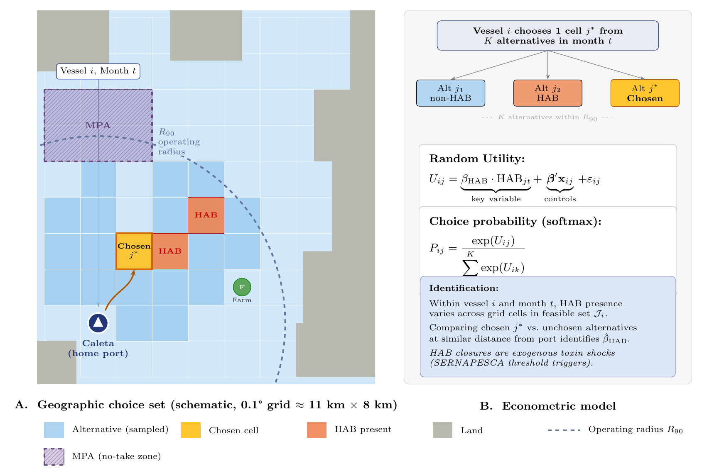

<a href="../index.qmd">← Back to Projects</a>

## Overview

Artisanal fishing vessels in southern Chile decide where to operate on a given day. Those decisions respond to the sea itself, through harmful algal blooms (HABs), to regulation, through marine protected areas (MPAs), and to other users of the same waters, through salmon farms. This project studies that location choice.

::: {.callout-note}
This is an ongoing project. The data, approach and results described here may still be refined.
:::

## Where the fleet fishes

{fig-alt="Heatmap of fishing-speed position reports in the interior sea of Los Lagos, Chile, 2019 to 2026" width="100%"}

### What data we have

The analysis uses satellite position reports from SERNAPESCA, Chile's National Fisheries and Aquaculture Service, for registered artisanal vessels.

- **Coverage:** 2019 to 2026. Reporting in 2021 is much thinner than in other years.
- **Volume:** about 10.3 million position reports across Los Lagos from roughly 330 vessel identifiers. About 7.4 million fall in the interior sea shown above, and about 0.9 million of those were recorded at fishing speed.
- **Frequency:** one position about every 15 minutes per vessel.
- **Content:** vessel identifier, timestamp, latitude, longitude, speed and heading.

## How we identify the choice

{fig-alt="Two-panel schematic. Panel A shows a map of grid cells around a home port with the operating radius, a marine protected area, HAB cells, a salmon farm and the chosen cell. Panel B shows the random utility model, the softmax choice probability and the identification argument" width="100%"}

Each vessel chooses one grid cell, about 11 × 8 km, from the set of cells it could reach within its operating radius around the home port. Choices are compared against a sample of alternative cells. This setup lets a conditional logit model, in the tradition of random utility models (McFadden, 1974; Train, 2009), estimate how the characteristics of each cell affect the probability that it is chosen.

Identification comes from variation within a vessel and month. Holding the vessel and month fixed, the model compares the cell a vessel chose with cells it could have chosen at a similar distance from port but that differ in environmental or policy conditions.

The figure is a schematic. The positions of the port, the MPA, the farm and the HAB cells are illustrative and do not reproduce the estimation sample.

## Environmental and policy factors

- **Harmful algal blooms (HABs).** Cells where a bloom is present, and the closures triggered when toxin thresholds are exceeded. Closures are treated as exogenous shocks to the toxin environment.
- **Marine protected areas (MPAs).** No-take zones where fishing is not permitted, which change the set of cells available to a vessel.
- **Salmon farms.** Proximity to aquaculture sites, which can change both the attractiveness of nearby waters and the effort vessels allocate around them.

Distance to port and other oceanographic conditions enter the model as controls.
